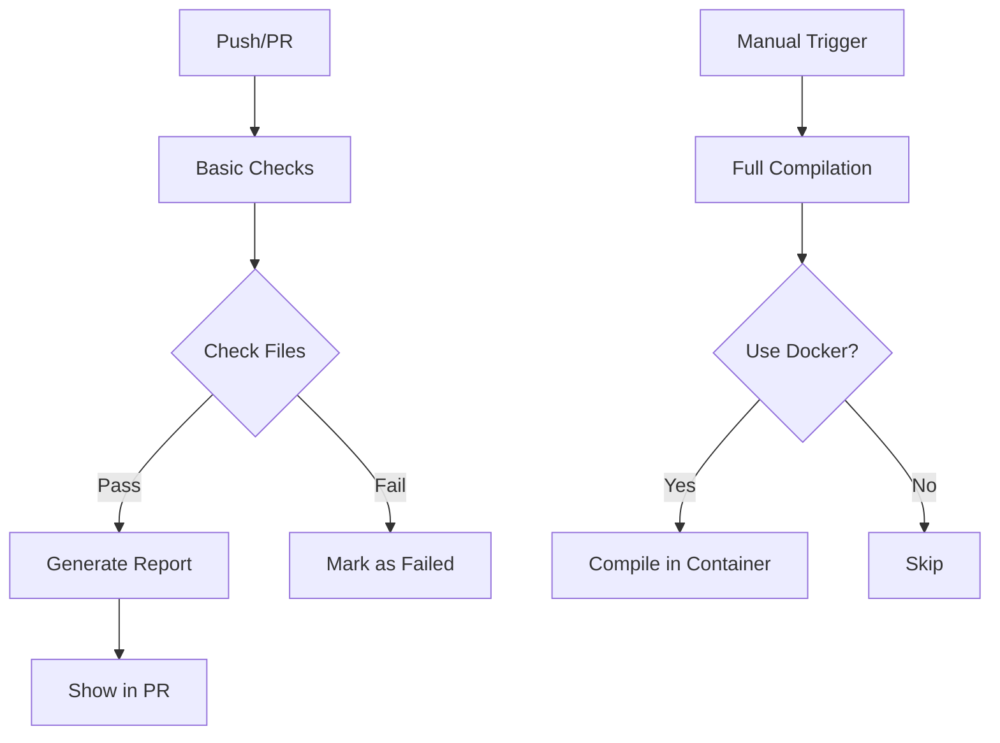

# GitHub Actions 基本 CI 指南

## 🎯 目标

为 fafafa.ssl 项目提供轻量级的自动化检查，**不依赖 FPC 编译**。

---

## ✅ 当前状态

### 🟢 基本检查 (可用)
- ✅ 文件结构检查
- ✅ 必需文件验证
- ✅ Pascal 语法基本检查
- ✅ 代码统计报告

### 🔴 完整编译 (暂时禁用)
- ❌ FPC 编译器安装困难
- ❌ 不同平台依赖差异
- ❌ GitHub Actions 环境限制

---

## 🚀 启用完整编译的方法

### 方法 1: 使用预配置环境

**推荐**: 使用包含 FPC 的 Docker 镜像

```yaml
jobs:
  build:
    runs-on: ubuntu-latest
    steps:
      - uses: actions/checkout@v4
      - name: Run with FPC Docker
        run: |
          docker run --rm -v "$PWD":/src dtamade/fpc-builder \
            sh -c "cd /src && fpc -Fusrc -FEtests/bin test_p2_pkcs7_comprehensive.pas"
```

### 方法 2: 本地构建 + 提交

**步骤**:
1. 在本地安装 FPC
2. 编译测试程序
3. 提交编译后的二进制文件到 GitHub

```bash
# 本地执行
fpc -Fusrc -FEtests/bin test_p2_pkcs7_comprehensive.pas
git add tests/bin/
git commit -m "feat: 更新测试二进制文件"
git push
```

### 方法 3: 自托管 Runner

**设置**:
1. 配置有 FPC 的服务器作为 GitHub Runner
2. 在 runner 上执行编译

---

## 📊 当前基本检查内容

### 1. 文件结构验证
```
✅ 源文件: $(find src/ -name "*.pas" | wc -l)
✅ 测试文件: $(find tests/ -name "*.pas" | wc -l)
✅ 文档: $(find . -name "*.md" | wc -l)
```

### 2. 必需文件检查
- README.md
- CLAUDE.md
- src/fafafa.ssl.abstract.intf
- src/fafafa.ssl.factory

### 3. Pascal 语法检查
- 单元声明 (unit...)
- 接口部分 (interface)
- 实现部分 (implementation)

### 4. 报告生成
- 项目统计信息
- 文件数量统计
- 检查结果汇总

---

## 🔄 工作流流程



---

## 💡 最佳实践

### 对于开发者
1. **本地编译** - 在提交前本地测试
2. **基本检查** - 依赖 GitHub Actions 的基础验证
3. **手动触发** - 需要时手动运行完整编译

### 对于贡献者
1. 运行 `scripts/check_code_style.py` 本地检查
2. 确保所有文件结构正确
3. 查看基本检查结果了解代码变更影响

---

## 📈 替代方案对比

| 方案 | 优点 | 缺点 | 适用场景 |
|------|------|------|----------|
| **基本检查** | ✅ 快速、可靠、无依赖 | ❌ 不验证编译 | 日常开发、PR 检查 |
| **Docker 编译** | ✅ 完全隔离、可重现 | ❌ 复杂、耗时 | 完整验证、发布前 |
| **自托管 Runner** | ✅ 灵活、完全控制 | ❌ 需要服务器 | 企业内部、持续开发 |
| **本地编译** | ✅ 完全验证 | ❌ 不自动化 | 个人开发、发布准备 |

---

## 🎯 建议

### 当前阶段 (阶段 4)
使用 **基本检查** 验证代码结构，确保 PR 质量。

### 下一阶段 (发布前)
1. 启用 Docker 编译进行完整验证
2. 或设置自托管 runner
3. 或在发布前本地执行完整编译

---

## 🔧 配置

### 启用/禁用工作流
```bash
# 禁用
mv .github/workflows/basic-checks.yml .github/workflows/basic-checks.yml.disabled

# 启用
mv .github/workflows/basic-checks.yml.disabled .github/workflows/basic-checks.yml
```

### 自定义检查
编辑 `.github/workflows/basic-checks.yml` 添加检查步骤。

---

## 📞 支持

如果需要启用完整编译：
1. 查看 [FPC 安装指南](https://www.freepascal.org/docs.html)
2. 使用 Docker 镜像: `dtamade/fpc-builder`
3. 联系维护者设置自托管 runner

---

**状态**: 基本检查已启用 ✅
**版本**: v1.0
**日期**: 2025-10-26
