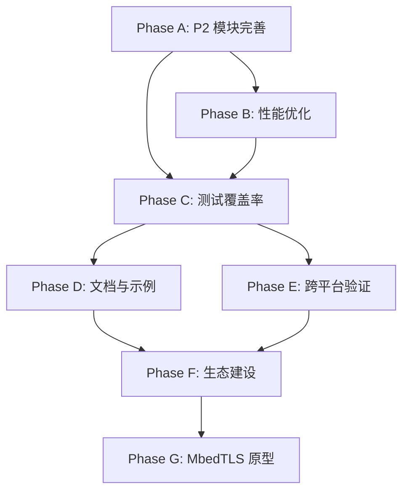

# 方案 A 详细实施计划（2026年2月 - 2027年1月）

**创建日期**: 2026-01-20
**规划周期**: 12 个月
**资源投入**: 1.1 FTE
**方案类型**: 稳健推进型

---

## 执行摘要

基于项目当前 95% 测试通过率和 WinSSL 后端 100% 完成的里程碑，本详细规划聚焦于：

1. **解决 P2 模块状态矛盾**（文档显示 18% vs 实际 95.8% 通过率）
2. **性能优化与基准测试集成**（TLS 握手、SHA-256、AES-256-GCM）
3. **测试覆盖率提升**（从 95% 提升到 98%+）
4. **文档与示例完善**（从 70% 提升到 90%）
5. **跨平台验证**（macOS、FreeBSD/OpenBSD）
6. **生态建设**（Lazarus 包管理器、社区贡献）
7. **MbedTLS 后端原型**（可行性研究与核心功能实现）

---

## 📅 Phase A：P2 模块完善与文档对齐（2026年2月）

### 目标
解决 P2 模块状态矛盾，补充 PKCS12 可选函数，更新文档以反映真实状态

### 任务分解

**Week 1-2：状态验证与差异分析**
- [ ] 运行完整的 P2 模块测试套件，记录实际通过率
- [ ] 对比 `docs/DEVELOPMENT_ROADMAP_2026.md`（18% 完成度）与 `docs/P2_MODULES_VERIFICATION_SUMMARY.md`（95.8% 通过率）
- [ ] 识别 PKCS12 模块中 OpenSSL 3.x 不可用的可选函数
- [ ] 生成差异报告：`docs/P2_STATUS_RECONCILIATION_REPORT.md`

**Week 3：PKCS12 可选函数补充**
- [ ] 分析 `src/fafafa.ssl.openssl.api.pkcs12.pas` 中标记为可选的函数
- [ ] 实现 fallback 方案：
  - `PKCS12_get_cert` → 使用 `PKCS12_parse` 实现
  - `PKCS12_get_pkey` → 使用 `PKCS12_parse` 实现
  - `PKCS12_get1_certs` → 返回证书链
- [ ] 更新测试用例以覆盖新的实现路径
- [ ] 验证 OpenSSL 1.1.1 和 3.x 双版本兼容性

**Week 4：文档更新与验收**
- [ ] 更新 `docs/DEVELOPMENT_ROADMAP_2026.md` 中的 P2 模块完成度
- [ ] 更新 `docs/FINAL_PROJECT_STATUS.md` 以反映真实状态
- [ ] 更新 `README.md` 中的完成度徽章
- [ ] 生成统一的项目状态报告

### 验收标准
- ✅ P2 模块实际完成度与文档描述一致
- ✅ PKCS12 可选函数有明确的 fallback 实现
- ✅ 所有 P2 模块测试通过率 ≥ 95%
- ✅ 文档更新完成并通过审查

### 技术细节

**PKCS12 Fallback 实现策略**：
```pascal
// 示例：PKCS12_get_cert fallback 实现
function PKCS12_get_cert_fallback(p12: PPKCS12; const pass: PAnsiChar): PX509; cdecl;
var
  pkey: PEVP_PKEY;
  cert: PX509;
  ca: PSTACK_OF_X509;
begin
  Result := nil;
  if PKCS12_parse(p12, pass, @pkey, @cert, @ca) = 1 then
  begin
    Result := cert;
    // 释放不需要的资源
    if pkey <> nil then EVP_PKEY_free(pkey);
    if ca <> nil then sk_X509_pop_free(ca, @X509_free);
  end;
end;
```

### 风险与缓解
- **风险**：OpenSSL 3.x API 差异导致功能缺失
- **缓解**：使用高层 API 替代，或标记为"仅 OpenSSL 1.1.1 支持"
- **风险**：Fallback 实现的内存管理错误
- **缓解**：严格的 RAII 模式 + Valgrind 检测

---

## 🚀 Phase B：性能优化与基准测试（2026年3月）

### 目标
实现缺失的基准测试，集成性能回归测试到 CI，优化内存管理

### 任务分解

**Week 1：基准测试实现**
- [ ] 验证 `tests/benchmarks/benchmark_tls_handshake.pas` 是否已存在
- [ ] 验证 `tests/benchmarks/benchmark_crypto_comprehensive.pas` 中的 SHA-256 和 AES-256-GCM 测试
- [ ] 统一基准测试框架，确保结果可重现
- [ ] 实现确定性测试（固定迭代次数、预热阶段）

**Week 2：性能基线建立**
- [ ] 在 Linux/Windows/macOS 上运行基准测试
- [ ] 生成平台特定的性能基线文件
- [ ] 更新 `tests/benchmarks/baseline_reference.json`
- [ ] 文档化基准测试运行方法

**Week 3：CI 集成**
- [ ] 启用 `.github/workflows/performance.yml`
- [ ] 配置性能回归阈值（建议 15%）
- [ ] 集成到 PR 检查流程
- [ ] 测试 CI 性能测试流程
- [ ] 更新 `scripts/ci_benchmark.sh`

**Week 4：内存优化**
- [ ] 使用 Valgrind 检测内存泄漏
- [ ] 优化 Pascal/C 边界的内存管理
- [ ] 分析频繁分配的热点
- [ ] 验证优化效果（内存使用 -10%）

### 验收标准
- ✅ TLS 握手、SHA-256、AES-256-GCM 基准测试完整
- ✅ 性能回归测试集成到 CI
- ✅ 内存泄漏检测通过（Valgrind 0 errors）
- ✅ 性能基线文档化

### 技术细节

**性能基线示例**：
```json
{
  "platform": "linux-x64",
  "openssl_version": "3.0.2",
  "benchmarks": {
    "tls_handshake": {
      "mean": 3200,
      "stddev": 150,
      "p95": 3500,
      "unit": "ops/s"
    },
    "sha256": {
      "mean": 450000,
      "stddev": 5000,
      "p95": 460000,
      "unit": "ops/s"
    }
  }
}
```

### 风险与缓解
- **风险**：CI 环境性能不稳定
- **缓解**：使用中位数/P95，增加迭代次数（500+）
- **风险**：内存优化引入新 bug
- **缓解**：完整的回归测试 + Valgrind 验证

---

## ✅ Phase C：测试覆盖率提升（2026年4-5月）

### 目标
从 95% 测试通过率提升到 98%+，增加边缘案例测试，实现 API 表面覆盖率跟踪

### 任务分解

**Month 1（4月）：边缘案例测试**
- [ ] 识别未覆盖的错误路径
- [ ] 添加握手失败场景测试（证书过期、主机名不匹配）
- [ ] 添加证书验证失败测试（自签名、链断裂）
- [ ] 添加内存不足场景测试（模拟分配失败）
- [ ] 添加并发连接测试（多线程安全性）
- [ ] 添加协议降级攻击测试

**Month 2（5月）：API 表面覆盖率**
- [ ] 使用 `scripts/check_interface_completeness.py` 生成 API 列表
- [ ] 识别未测试的公共 API（目标：100% 覆盖）
- [ ] 为每个公共 API 添加至少一个测试
- [ ] 实现 API 覆盖率跟踪脚本
- [ ] 集成到 CI 报告
- [ ] 生成覆盖率徽章

### 验收标准
- ✅ 测试通过率 ≥ 98%
- ✅ API 表面覆盖率 ≥ 90%
- ✅ 边缘案例测试覆盖关键错误路径
- ✅ CI 报告包含覆盖率指标

### 技术细节

**API 覆盖率跟踪**：
```bash
# scripts/api_coverage.sh
#!/bin/bash
# 扫描所有公共接口
grep -r "function.*public" src/ | wc -l
# 扫描测试中调用的接口
grep -r "TestCase.*function" tests/ | wc -l
# 计算覆盖率
```

### 风险与缓解
- **风险**：FreePascal 缺少代码覆盖率工具
- **缓解**：使用 API 表面覆盖率作为替代指标
- **风险**：边缘案例测试难以复现
- **缓解**：使用 mock 和 stub 技术

---

## 📚 Phase D：文档与示例完善（2026年6-7月）

### 目标
重组 41 个 test_ 前缀文件为示例，创建示例索引，补充企业场景示例

### 任务分解

**Month 1（6月）：示例重组**
- [ ] 审查 41 个 test_ 前缀文件
- [ ] 分类为：
  - 基础示例（10个）：简单客户端/服务器、证书加载
  - 高级示例（15个）：会话复用、ALPN、双向 TLS
  - 企业场景（16个）：OCSP Stapling、高并发、证书链验证
- [ ] 重命名并移动到 `examples/` 目录
- [ ] 添加详细注释和说明（每个示例 ≥ 50 行注释）
- [ ] 创建 `examples/EXAMPLES_INDEX.md`

**Month 2（7月）：企业场景示例**
- [ ] 双向 TLS（客户端证书）示例
- [ ] OCSP Stapling 示例
- [ ] 会话复用优化示例（性能对比）
- [ ] 高并发服务器示例（线程池）
- [ ] 证书链验证示例（自定义验证逻辑）
- [ ] 更新 `docs/EXAMPLES_AND_DOCS_IMPROVEMENT_PLAN.md`

### 验收标准
- ✅ 41 个 test_ 文件重组完成
- ✅ 示例索引创建并分类清晰
- ✅ 至少 5 个企业场景示例
- ✅ 文档完成度从 70% 提升到 90%
- ✅ 所有示例在 CI 中编译通过

### 技术细节

**示例索引结构**：
```markdown
# 示例程序索引

## 基础示例
- [simple_client.pas](basic/simple_client.pas) - 简单 TLS 客户端
- [simple_server.pas](basic/simple_server.pas) - 简单 TLS 服务器

## 高级示例
- [session_resumption.pas](advanced/session_resumption.pas) - 会话复用

## 企业场景
- [mutual_tls.pas](enterprise/mutual_tls.pas) - 双向 TLS 认证
```

### 风险与缓解
- **风险**：示例代码过时
- **缓解**：在 CI 中编译所有示例
- **风险**：示例缺少错误处理
- **缓解**：代码审查 + 最佳实践检查

---

## 🌍 Phase E：跨平台验证（2026年8-9月）

### 目标
macOS 完整测试和 CI 集成，FreeBSD/OpenBSD 初步支持

### 任务分解

**Month 1（8月）：macOS 支持**
- [ ] 在 macOS 上运行完整测试套件
- [ ] 修复平台特定问题（路径分隔符、动态库加载）
- [ ] 配置 macOS CI（GitHub Actions）
- [ ] 更新 `docs/PLATFORM_SUPPORT.md`
- [ ] 添加 macOS 构建脚本
- [ ] 验证 OpenSSL 3.x 在 macOS 上的兼容性

**Month 2（9月）：BSD 支持**
- [ ] FreeBSD 编译和测试（使用 Docker）
- [ ] OpenBSD 编译和测试（使用 Docker）
- [ ] 文档化 BSD 构建说明
- [ ] 标记已知限制（如 WinSSL 不可用）
- [ ] 创建 BSD 测试脚本

### 验收标准
- ✅ macOS 测试通过率 ≥ 95%
- ✅ macOS CI 集成完成
- ✅ FreeBSD/OpenBSD 编译成功
- ✅ 平台支持文档更新
- ✅ 三大平台（Linux/Windows/macOS）完全支持

### 技术细节

**平台特定问题**：
- macOS：动态库路径（`@rpath`）
- FreeBSD：OpenSSL 路径（`/usr/local/lib`）
- OpenBSD：LibreSSL vs OpenSSL

### 风险与缓解
- **风险**：BSD 平台 OpenSSL 版本差异
- **缓解**：使用动态函数加载适配
- **风险**：macOS CI 资源限制
- **缓解**：优化测试套件，减少运行时间

---

## 🌱 Phase F：生态建设（2026年10-11月）

### 目标
Lazarus 包管理器集成，社区贡献指南，第三方集成示例

### 任务分解

**Month 1（10月）：包管理器集成**
- [ ] 创建 Lazarus 包描述文件（`.lpk`）
- [ ] 测试 OPM（Online Package Manager）集成
- [ ] 创建安装文档
- [ ] 发布到 Lazarus 包仓库
- [ ] 添加版本管理和更新机制

**Month 2（11月）：社区生态**
- [ ] 完善 `CONTRIBUTING.md`（贡献流程、代码规范）
- [ ] 创建 Issue 模板（Bug 报告、功能请求）
- [ ] 创建 PR 模板（变更说明、测试清单）
- [ ] 添加第三方集成示例：
  - Indy 集成示例
  - Synapse 集成示例
- [ ] 创建社区论坛或 Discord 频道

### 验收标准
- ✅ Lazarus 包管理器集成完成
- ✅ 社区贡献指南完善
- ✅ 至少 2 个第三方集成示例
- ✅ 社区反馈机制建立
- ✅ 至少 5 个外部贡献者

### 技术细节

**Lazarus 包描述文件**：
```xml
<?xml version="1.0" encoding="UTF-8"?>
<CONFIG>
  <Package Version="5">
    <Name Value="fafafa_ssl"/>
    <Type Value="RunAndDesignTime"/>
    <CompilerOptions>
      <Version Value="11"/>
      <SearchPaths>
        <IncludeFiles Value="src"/>
        <OtherUnitFiles Value="src"/>
        <UnitOutputDirectory Value="lib/$(TargetCPU)-$(TargetOS)"/>
      </SearchPaths>
    </CompilerOptions>
  </Package>
</CONFIG>
```

### 风险与缓解
- **风险**：社区参与度低
- **缓解**：主动推广，提供详细文档
- **风险**：第三方集成维护负担
- **缓解**：明确维护责任，社区共同维护

---

## 🔬 Phase G：MbedTLS 后端原型（2026年12月 - 2027年1月）

### 目标
可行性研究，核心功能原型，性能对比测试

### 任务分解

**Month 1（12月）：可行性研究**
- [ ] 分析 MbedTLS API 与 `ISSLLibrary` 接口的匹配度
- [ ] 识别功能差异和限制：
  - 证书存储机制
  - 随机数生成
  - 会话管理
- [ ] 评估许可证兼容性（Apache 2.0 vs MIT）
- [ ] 生成可行性报告：`docs/MBEDTLS_FEASIBILITY_REPORT.md`
- [ ] 决策：继续/暂停/调整方案

**Month 2（1月）：原型实现**
- [ ] 实现基础 TLS 客户端连接
- [ ] 实现证书验证（链验证、主机名验证）
- [ ] 实现基础加密操作（AES、SHA）
- [ ] 性能对比测试（vs OpenSSL）
- [ ] 生成原型报告：`docs/MBEDTLS_PROTOTYPE_REPORT.md`

### 验收标准
- ✅ 可行性报告完成
- ✅ MbedTLS 后端原型实现核心功能
- ✅ 性能对比数据生成
- ✅ 决策：是否继续完整实现

### 技术细节

**MbedTLS vs OpenSSL API 对比**：
| 功能 | OpenSSL | MbedTLS | 兼容性 |
|------|---------|---------|--------|
| TLS 1.3 | ✅ | ✅ | 高 |
| 证书链验证 | ✅ | ✅ | 高 |
| 会话复用 | ✅ | ✅ | 中 |
| PKCS12 | ✅ | ❌ | 低 |

### 风险与缓解
- **风险**：MbedTLS API 差异过大
- **缓解**：使用适配层，标记不支持的功能
- **风险**：性能不如 OpenSSL
- **缓解**：明确定位为"轻量级替代方案"

---

## 📊 资源分配

| 阶段 | 时间 | FTE | 优先级 |
|------|------|-----|--------|
| Phase A | 2026-02 | 0.2 | P0 |
| Phase B | 2026-03 | 0.2 | P0 |
| Phase C | 2026-04-05 | 0.3 | P0 |
| Phase D | 2026-06-07 | 0.3 | P1 |
| Phase E | 2026-08-09 | 0.3 | P1 |
| Phase F | 2026-10-11 | 0.3 | P2 |
| Phase G | 2026-12-2027-01 | 0.3 | P2 |

**总资源**: 1.1 FTE × 12 个月 = 13.2 人月

---

## 🎯 关键成功因素

1. **质量优先**：每个阶段都有明确的验收标准
2. **风险可控**：每个阶段都有风险评估和缓解措施
3. **用户价值**：文档和示例改进直接提升用户体验
4. **持续集成**：性能和测试覆盖率集成到 CI
5. **社区参与**：建立活跃的社区生态

---

## 📈 进度跟踪

### 月度检查点
- **每月末**：评估进度和调整计划
- **检查内容**：
  - 任务完成率
  - 验收标准达成情况
  - 风险评估更新
  - 资源使用情况

### 季度回顾
- **Q1 (2026-02-04)**：P2 模块完善、性能优化、测试覆盖率提升
- **Q2 (2026-05-07)**：文档与示例完善
- **Q3 (2026-08-10)**：跨平台验证、生态建设
- **Q4 (2026-11-2027-01)**：生态建设、MbedTLS 原型

### 文档更新
- 实时更新 `docs/DEVELOPMENT_ROADMAP_2026.md`
- 每月生成进度报告
- 每季度更新项目状态

---

## 🔗 依赖关系



**关键路径**：A → B → C → E → F → G

---

## 📝 变更管理

### 计划调整流程
1. 识别变更需求
2. 评估影响范围
3. 更新计划文档
4. 通知相关方
5. 记录变更历史

### 风险升级机制
- **低风险**：团队内部处理
- **中风险**：项目负责人决策
- **高风险**：暂停并重新评估

---

## 🎓 经验教训

### 从历史项目中学习
- ✅ **WinSSL 100% 完成**：分阶段实施，每个阶段都有明确交付物
- ✅ **测试通过率 95%**：持续集成和自动化测试
- ⚠️ **P2 模块状态矛盾**：文档与实际状态不一致

### 最佳实践
- 每个阶段都有明确的验收标准
- 风险评估和缓解措施
- 持续集成和自动化测试
- 文档与代码同步更新

---

## 📞 联系方式

- **项目负责人**: [待定]
- **技术负责人**: [待定]
- **社区联系**: [待定]

---

**文档版本**: 1.0
**最后更新**: 2026-01-20
**下次审查**: 2026-02-28
